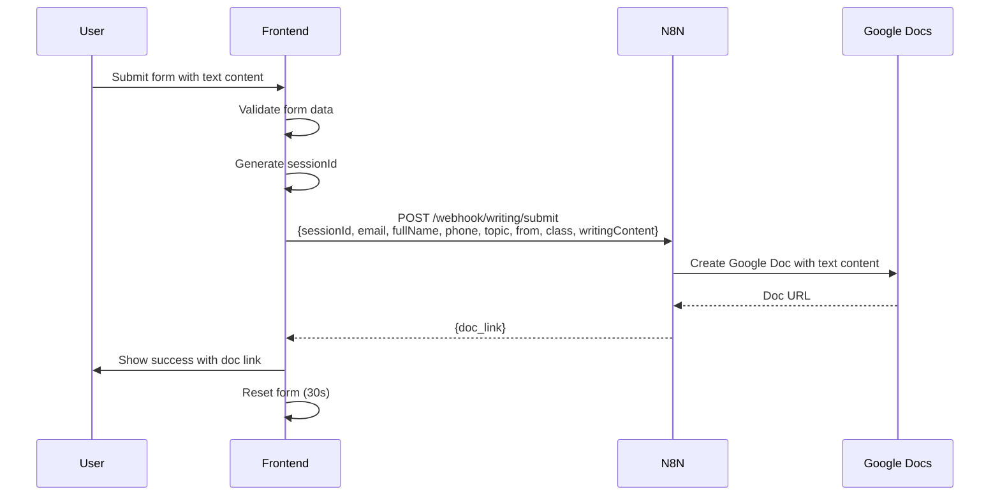

# Submit Flow Documentation

## Upload Sequence Flow



### Legacy Flow (for comparison)

```
User submits form
    ↓
Validate form data
    ↓
POST all files to N8N
    ↓
N8N uploads to Google Drive
    ↓
N8N creates Google Doc
    ↓
Return doc links
```

## Key Functions in Code

### `getPresignedUrl(sessionId, email, fileName)`
- **Purpose**: Retrieves presigned URL for file upload
- **Method**: GET
- **Endpoint**: `https://n8n.dungenglishspeaking.com/webhook/speaking/submit`
- **Parameters**: sessionId, email, fileName (query params)
- **Response**: `{ "url": "/object/upload/sign/.../filename?token=...", "token": "..." }`

### `uploadToSupabase(file, presignedData, fileIndex)`
- **Purpose**: Uploads file directly to Supabase storage
- **Method**: PUT
- **Endpoint**: `https://hwqxigmopqkiqmogkaxt.storage.supabase.co/storage/v1{url}`
- **Headers**: `Content-Type: file.type`
- **Body**: File blob data
- **Progress**: Tracks upload progress per file

### `submitWriting(sessionId, email, fullName, phone, topic, from, class, writingContent)`
- **Purpose**: Submits writing content directly
- **Method**: POST
- **Endpoint**: `https://n8n.dungenglishspeaking.com/webhook/writing/submit`
- **Headers**: `Content-Type: application/json`
- **Body**:
  ```json
  {
    "sessionId": "writing_1234567890_abc123def",
    "email": "user@example.com",
    "fullName": "Nguyễn Văn A",
    "phone": "0901234567",
    "topic": "Free text topic input", // Optional free text
    "from": "writing",
    "class": "lop-243578", // Selected from dropdown loaded from classes.json
    "writingContent": "This is the text content of the writing submission..."
  }
  ```
- **Response**: `{ "doc_link": "https://docs.google.com/document/d/..." }`

### `uploadSubmission(formData, sessionId)`
- **Purpose**: Orchestrates the entire upload process
- **Flow**:
  1. Loop through selected files
  2. For each file: getPresignedUrl → uploadToSupabase
  3. After all files: finalizeSubmission
  4. Return result with docLink

## Error Handling

- **Presigned URL failure**: Stops process, shows error
- **Supabase upload failure**: Stops process, shows error
- **Final submission failure**: Shows error message
- **Progress tracking**: Per-file progress bars
- **User protection**: Warns before leaving during upload

## UI States

- **File status**: "Chờ tải lên" → "Đang tải lên..." → "Hoàn thành ✓" / "Lỗi tải lên ✗"
- **Overall progress**: Combined progress bar (completed_files / total_files * 100)
- **Success message**: Shows file count + doc link
- **Form reset**: Automatic after 30 seconds
- **Writing submission**: Topic is free text input (optional), class field is a dropdown loaded from `classes.json`

## Technical Details

- **File validation**: MP3, WAV, M4A only, max 50MB each (for audio submissions). For writing submissions, text content is uploaded as a .txt file.
- **Topics for writing**: Loaded dynamically from `classes.json` file for flexibility.
- **Progress tracking**: XMLHttpRequest upload progress events
- **Session management**: Unique sessionId per submission batch
- **Error isolation**: Failed file doesn't affect others (but stops batch)
- **Network handling**: Proper error responses and timeouts
- **SPA Routing**: Requires `.htaccess` file for Apache servers to enable client-side routing for class-specific paths

## Server Configuration

For the class-specific paths (`/lop-4658`, `/lop-275878`, `/lop-243578`) to work, the web server must be configured to serve `index.html` for all routes.

### Apache Servers (.htaccess)
The included `.htaccess` file handles SPA routing for Apache servers:

```apache
Options -MultiViews
RewriteEngine On
RewriteCond %{REQUEST_FILENAME} !-f
RewriteCond %{REQUEST_FILENAME} !-d
RewriteRule ^ index.html [QSA,L]
```

### GitHub Pages
For GitHub Pages hosting, the `.nojekyll` file disables Jekyll processing. Each class path has its own `index.html` file with hardcoded class options:

```
/
├── index.html (main file - class selection for speaking and writing)
├── classes.json (topics for writing submissions)
├── lop-4658/
│   └── index.html (lop-4658 speaking class options hardcoded)
├── lop-275878/
│   └── index.html (lop-275878 speaking class options hardcoded)
├── lop-243578/
│   └── index.html (lop-243578 speaking class options hardcoded)
└── writing/
    ├── index.html (writing submission with class selection - DEPRECATED)
    ├── lop-243578/
    │   └── index.html (writing submission for lop-243578)
    ├── lop-cuoi-tuan/
    │   └── index.html (writing submission for lop-cuoi-tuan)
    ├── lop-4658/
    │   └── index.html (writing submission for lop-4658)
    └── nop-lai/
        └── index.html (writing submission for nop-lai)
```

**Class Options:**
- **lop-4658**: t46 chiều (dl thứ 4 hàng tuần), t46 tối (dl thứ 4 hàng tuần), t5cn tối (dl thứ 5 hàng tuần)
- **lop-275878**: t27 (dl t7 hằng tuần), t5cn (dl chủ nhật hằng tuần), t7cn (dl chủ nhật hằng tuần)
- **lop-243578**: t24 (dl thứ 4 hàng tuần), t35 (dl thứ 5 hàng tuần), t78 (dl cn hàng tuần)
- **writing**: Separate pages for lop-243578, lop-cuoi-tuan, lop-4658, nop-lai (classes loaded from classes.json)

### Other Web Servers
For Nginx, add this to your server block:
```nginx
location / {
    try_files $uri $uri/ /index.html;
}
```

For other servers, configure them to serve `index.html` as the fallback for all routes that don't match actual files.
