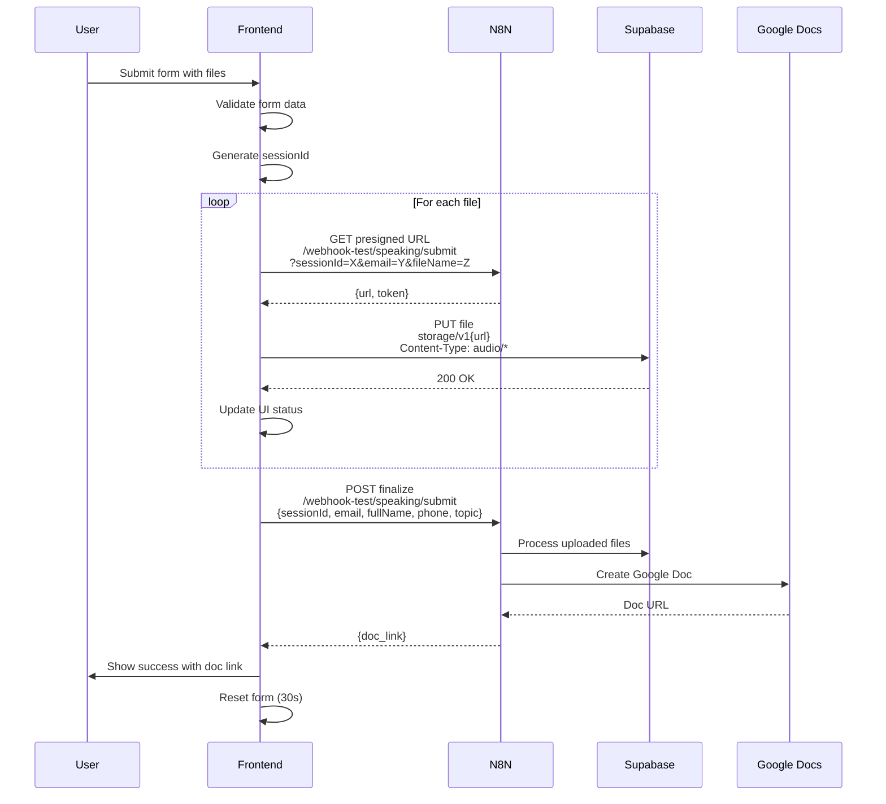

# Submit Flow Documentation

## Upload Sequence Flow



### Legacy Flow (for comparison)

```
User submits form
    ↓
Validate form data
    ↓
POST all files to N8N
    ↓
N8N uploads to Google Drive
    ↓
N8N creates Google Doc
    ↓
Return doc links
```

## Key Functions in Code

### `getPresignedUrl(sessionId, email, fileName)`
- **Purpose**: Retrieves presigned URL for file upload
- **Method**: GET
- **Endpoint**: `https://n8n-mac.quocbangdev.asia/webhook-test/speaking/submit`
- **Parameters**: sessionId, email, fileName (query params)
- **Response**: `{ "url": "/object/upload/sign/.../filename?token=...", "token": "..." }`

### `uploadToSupabase(file, presignedData, fileIndex)`
- **Purpose**: Uploads file directly to Supabase storage
- **Method**: PUT
- **Endpoint**: `https://hwqxigmopqkiqmogkaxt.storage.supabase.co/storage/v1{url}`
- **Headers**: `Content-Type: file.type`
- **Body**: File blob data
- **Progress**: Tracks upload progress per file

### `finalizeSubmission(sessionId, email, fullName, phone, topic)`
- **Purpose**: Completes submission and generates document
- **Method**: POST
- **Endpoint**: `https://n8n-mac.quocbangdev.asia/webhook-test/speaking/submit`
- **Headers**: `Content-Type: application/json`
- **Body**:
  ```json
  {
    "sessionId": "submit_1234567890_abc123def",
    "email": "user@example.com",
    "fullName": "Nguyễn Văn A",
    "phone": "0901234567",
    "topic": "Giới thiệu bản thân"
  }
  ```
- **Response**: `{ "doc_link": "https://docs.google.com/document/d/..." }`

### `uploadSubmission(formData, sessionId)`
- **Purpose**: Orchestrates the entire upload process
- **Flow**:
  1. Loop through selected files
  2. For each file: getPresignedUrl → uploadToSupabase
  3. After all files: finalizeSubmission
  4. Return result with docLink

## Error Handling

- **Presigned URL failure**: Stops process, shows error
- **Supabase upload failure**: Stops process, shows error
- **Final submission failure**: Shows error message
- **Progress tracking**: Per-file progress bars
- **User protection**: Warns before leaving during upload

## UI States

- **File status**: "Chờ tải lên" → "Đang tải lên..." → "Hoàn thành ✓" / "Lỗi tải lên ✗"
- **Overall progress**: Combined progress bar (completed_files / total_files * 100)
- **Success message**: Shows file count + doc link
- **Form reset**: Automatic after 30 seconds

## Technical Details

- **File validation**: MP3, WAV, M4A only, max 50MB each
- **Progress tracking**: XMLHttpRequest upload progress events
- **Session management**: Unique sessionId per submission batch
- **Error isolation**: Failed file doesn't affect others (but stops batch)
- **Network handling**: Proper error responses and timeouts
